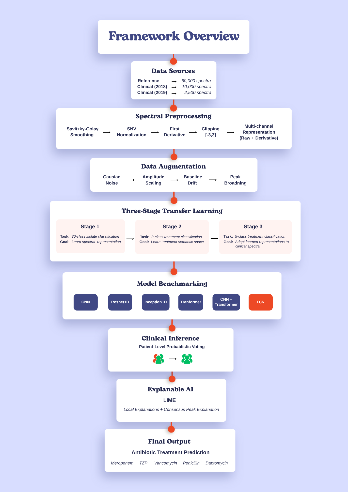

# Explainable AI Framework for Raman Spectroscopy-Based Antimicrobial Treatment Classification

## Project Title
Development of an Explainable AI Framework for Raman Spectroscopy-Based Antimicrobial Treatment Classification Using Three-Stage Transfer Learning

## Research Motivation & Problem Statement
Raman spectroscopy offers rapid, label-free bacterial identification. However, analyzing raw Raman spectra is complex due to biological variance, instrument noise, and domain shifts between laboratory and clinical settings. This project provides a reproducible and interpretable deep learning pipeline. It solves the domain-shift problem using a **Three-Stage Transfer Learning** approach, ultimately mapping isolate-level reference spectra to clinical treatment categories.

## Pipeline Overview
The repository implements the exact methodology described in the final research paper:

1. **Robust Preprocessing Pipeline**:
   - Savitzky-Golay Smoothing
   - Standard Normal Variate (SNV) Normalization
   - First Derivative Computation
   - Clip Transform
   - Data Augmentation
2. **Three-Stage Transfer Learning**:
   - **Stage 1**: 30 Isolate Classification (Pre-training on Reference Data)
   - **Stage 2**: 8 Treatment Groups (Semantic Alignment)
   - **Stage 3**: Clinical Transfer Learning (5 Treatment Classes)
3. **Robust Evaluation**:
   - Patient-Level Probabilistic Voting (Achieving 100% Patient-Level Accuracy)
4. **Explainable AI (XAI)**:
   - LIME-based Explainability
   - Consensus Raman Peak Analysis to extract biologically meaningful spectral features.

<p align="center">
  
</p>

<p align="center">
<b>Figure 1.</b> Overall workflow of the proposed three-stage transfer learning framework.
</p>

## Project Structure
```text
.
|-- artifacts/            # Publication checkpoints and released result figures
|-- assets/               # Documentation images
|-- configs/              # YAML configuration files
|   |-- data/             # Splits, preprocessing, and augmentation configs
|   |-- model/            # Architecture-specific hyperparameters
|   |-- stages/           # Stage 1/2/3 task definitions
|   `-- training/         # Shared optimizer, loss, scheduler, and evaluation defaults
|-- data/
|   `-- raw/              # Local .npy datasets; not redistributed
|-- docs/                 # Additional documentation
|-- metadata/             # Label ontology, isolates, treatments, and patient IDs
|-- notebooks/            # Canonical reproduction and analysis notebooks
|   `-- archive/          # Archived exploratory notebooks
|-- scripts/              # Executable entry points
|   |-- setup_data.py     # Data preparation and integrity checks
|   |-- train.py          # Stage 1/2/3 training entry point
|   |-- run_patient_cv.py # Stage 3 patient-aware CV orchestration
|   |-- evaluate.py       # Standalone evaluation
|   |-- analyze_experiment.py
|   |-- xai.py
|   `-- archive/          # Archived development scripts
|-- src/                  # Core package
|   |-- data/             # Dataset, dataloader, preprocessing, and split logic
|   |-- evaluation/       # Metrics, visualization, and clinical utilities
|   |-- models/           # CNN, ResNet1D, TCN, Transformer, Inception1D, hybrids
|   |-- training/         # Training loops, finetuning, losses, and schedulers
|   |-- utils/            # Config, checkpoints, logging, seeds, and split modes
|   `-- xai/              # LIME, saliency, and XAI orchestration
`-- tests/                # Unit and regression tests
```

## Installation
1. Clone the repository:
```bash
git clone https://github.com/rana-rohit/raman-spectral-classifier.git
cd raman-spectral-classifier
```
2. Create a virtual environment and install dependencies:
```bash
pip install -r requirements.txt
```

## Dataset

This project is built on the publicly available Raman spectroscopy datasets provided through the **RamanSPy** project. The repository **does not redistribute** the original datasets. Please download them from the official source before running the training pipeline.

The Raman Spectral Dataset is available through the RamanSPy:

https://ramanspy.readthedocs.io/en/latest/datasets.html

The datasets originate from:

Ho, C. S., et al. (2019), *Rapid identification of pathogenic bacteria using Raman spectroscopy and deep learning.*

Due to size constraints, the raw `.npy` Raman spectral datasets are not hosted in this repository. Place them under `data/raw/` before running the pipeline. The Colab workflow in `notebooks/00_getting_started.ipynb` links this directory from Google Drive.

To prepare and validate your data:
```bash
python scripts/setup_data.py --stage s1_isolate --split-mode iid_reference
python scripts/setup_data.py --stage s2_treatment --split-mode iid_reference
python scripts/setup_data.py --stage s3_transfer --split-mode patient_cv
```

## Official Workflow
The official execution order to reproduce the paper's results is:

1. **Set the output directory:**
```bash
export OUTPUT_DIR=experiments
```
2. **Train Stage 1 (TCN isolate pretraining):**
```bash
python scripts/train.py \
  --model tcn \
  --stage s1_isolate \
  --split-mode iid_reference \
  --exp-name tcn_s1_isolate_iid \
  --exp-dir "$OUTPUT_DIR" \
  --seed 42
```
3. **Train Stage 2 (TCN treatment pretraining):**
```bash
python scripts/train.py \
  --model tcn \
  --stage s2_treatment \
  --split-mode iid_reference \
  --override training.pretrained_checkpoint="$OUTPUT_DIR/tcn_s1_isolate_iid/checkpoints/best_model.pt" \
  --exp-name tcn_s2_treatment_iid \
  --exp-dir "$OUTPUT_DIR" \
  --seed 42
```
4. **Train Stage 3 (patient-aware clinical transfer):**
```bash
python scripts/run_patient_cv.py \
  --model tcn \
  --stage s3_transfer \
  --exp-name tcn_s3_transfer_ts_iid_patient_cv \
  --exp-dir "$OUTPUT_DIR" \
  --seed 42 \
  --override training.pretrained_checkpoint="$OUTPUT_DIR/tcn_s2_treatment_iid/checkpoints/best_model.pt"
```
5. **Evaluate and package the Stage 3 run:**
```bash
python scripts/analyze_experiment.py \
  --exp_dir "$OUTPUT_DIR/tcn_s3_transfer_ts_iid_patient_cv"
```
6. **Generate LIME and saliency explanations from one Stage 3 fold:**
```bash
python scripts/xai.py \
  --exp-dir "$OUTPUT_DIR/tcn_s3_transfer_ts_iid_patient_cv/fold_0_fold0"
```
7. **Compare models and run consensus peak analysis:**
```bash
python scripts/compare_models_xai.py --results-root "$OUTPUT_DIR"
```
8. **Generate research plots directly, if needed:**
```bash
python scripts/generate_research_plots.py \
  --exp_dir "$OUTPUT_DIR/tcn_s3_transfer_ts_iid_patient_cv"
```

## Results & Highlights
- **Best Model Architecture:** Temporal Convolutional Network (TCN)
- **Final Stage 3 Accuracy:** 96.0%
- **Final Patient-Level Accuracy:** 100%
- **Interpretability:** Successfully mapped predictive features back to known biological and chemical Raman peaks using Consensus Peak Analysis.

## License
Distributed under the MIT License. See `LICENSE` for more information.
